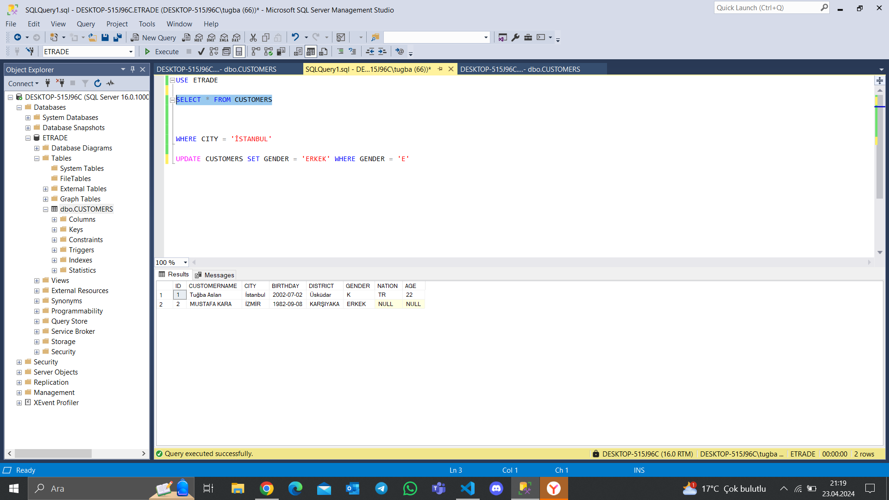
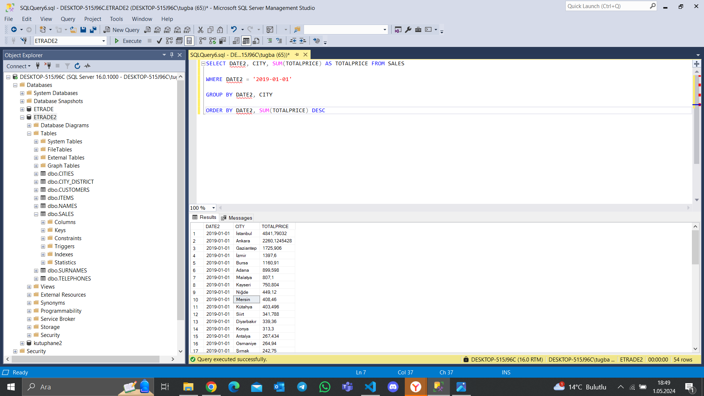

## Veritabanı nedir?

Temel anlamda içerisinde belli bir formatta sorgulanabilir şekilde veri barındıran yazılımlardır.

Verileri listeler haalinde tablo ve satırlarda tutan her yapı aslında kendi çaıpında veritabanıdır.

### Veritabanı nelerden oluşur?

- Tablolar
- Sütunlar
- Satırlar
- Indexler

### Veritabanı sunucu nedir?

- Bir yazılımdır.
- Network üzerinden bir porttan sistemi dinler ve gelen komutlara göre istenilen veriyi gönderir.
- SQL Server, MYSQL, PostgreSQL, Oracle gibi sistemler veritabanı sunucusudur.
- Access, Excel gibi yapılar ise bir sunucu değildir.


# Temel SQL Komutları

### Data Manipülasyon Komutları 
- `Select:` Varitabanındaki tablolardan kayıtları çeker.
- `Update:` Bir tablodaki kaydın bir ya da daha fazla alanını günceller, değiştirir.
- `Delete:` Bir tablodan kayıt siler.
- `Insert:` Tabloya yeni kayıt ekler.
- `Truncate:` Tablonun içini boşaltır.

### Veritabanı Manipülasyon Komutları
- `Create:` Bir veritabanı nesnesi oluşturur.
- `Alter:` Bir veritabanı nesnesinin özelliğini değiştirir.
- `Drop:` Bir veritabanı nesnesini siler.

## Data Manipülasyon Komutları 

### Select Komutu

```SQL
SELECT
KOLON1, KOLON2, KOLON3,...
FROM TABLOADI
WHERE<ŞARTLAR>
```


her tabloda benzersiz alan oluşturalım ve bunu otomatik artan olarak işaretleyim


Bir E-Ticaret sitesi oluşturmak için ETRADE database'i oluşturduk ve CUSTOMERS tablosu ekledik.

New Query dedikten sonra çıkan sayfada SQL cümlesi yazıyoruz.


SQL komutlarını yazdıktan sonra Run (veya F5) basarsak CUSTOMERS tablosundaki verileri getirecek.


'*' yerine gelmesini istediğimiz kolonları yazarsak sadece o kolonlar gelecektir.


kolon isimlerini yazarken boşluk, türkçe ve özel karakterler (_ dışında) kullanmıyoruz.

### Insert Komutu

```SQL
INSERT INTO TABLOADI
(KOLON1, KOLON2, KOLON3,...)
VALUES
(DEĞER1, DEĞER2, DEĞER3,...)
```


ID için otomatik artan işaretlemiştik. Değerleri yazarken ise kendimiz değer göndermeye çalıştığımız için hata aldık. (Girdiğimiz kolonlardan ID ve değer olarak girdiğimiz 5'i silmemiz gerekiyor.)

### Update Komutu

```SQL
UPDATE TABLOADI
SET COLUMN = VALUE1, COLUMN2 = VALUE2...
WHERE <ŞARTLAR>
```


NATION sütunu ekledik ve UPDATE komutunu yazdıktan sona bu sütünu güncelledik


AGE kolonu da ekledik ve herkesin yaşını 35 olarak güncelledik ama yaş değerleri herkes için aynı değil. Yaşı hesaplayarak getirebilir miyim?


Bunu DATEDIFF komutu ile yapabiliyorum.


Şimdiki tarihi almak istersek son parametreye GETDATE() yazabiliriz.


### Delete Komutu

```SQL
DELETE
FROM TABLOADI
WHERE <ŞARTLAR>
```


Tablodan her şeyi sildik

### Truncate Komutu

```SQL
TRUNCATE TABLE TABLOADI
```

En son DELETE komutu ile tablodan her şeyi silmiştik.

INSERT ile tabloya yeni müşteriler eklediğimizde otomatik artan alan varsa kaldığı yerde devam eder.

TRUNCATE komutu ile de tabloyu ilk haline getiriyoruz.

## Where Şartı

```SQL
SELECT
KOLON1, KOLON2, KOLON3,...
FROM TABLOADI
WHERE<ŞARTLAR>
```

Sadece İstanbul'da yaşayan müşterileri çekmek isteyebilirim:

```SQL
SELECT
KOLON1, KOLON2, KOLON3,...
FROM TABLOADI
WHERE<CITY = 'İSTANBUL'>
```

|        |  | 
|--------------|-------|
| =        | Eşittir | 
|<>        | Eşit değildir  |
| >         | Büyüktür  | 
|  <      | Küçüktür |
|  >=      | Büyüktür ya da eşittir | 
|   <=     | Küçüktür ya da eşittir | 
|  BETWEEN      | Arasındadır | 
|   LIKE      | İle başlar, İle biter, İçerir | 
|   IN     | İçindedir |  
|  NOT LIKE      | İle başlamaz, İle bitmez, İçermez |  
|   NOT IN     | İçinde değildir | 
 


Sadece İstanul'da yaşayan müşterileri çektik.

```SQL
/* İSMİ ALAN İÇERENLER */
WHERE CUSTOMERNAME LIKE '%ALAN%'
```

```SQL
/* İSMİ ALİ İLE BAŞLAMAYANLAR */
WHERE CUSTOMERNAME NOT LIKE 'ALİ%'
```

```SQL
/* 'CITY = İSTANBUL' İFADESİNE TEKABÜL EDECEK */
WHERE CITY IN ('İSTANBUL')
```

```SQL
/* ŞEHRİ İSTANBUL YA DA ANKARA OLANLARI GETİR */
WHERE CITY IN ('İSTANBUL', 'ANKARA')
```

```SQL
/* 'CITY = İSTANBUL' İFADESİNE TEKABÜL EDECEK */
WHERE CITY IN ('İSTANBUL')
```


GENDER'ın alan tipini değişştirmek istediğimde sistem izin vermedi.

Tools -> Options -> Designers -> Prevent saving changes that require table re-creation ifadesinden tik işaretini kaldırdığımızda tabloyu edit etmemize izin verecek



UPDATE komutu içinde bir WHERE şartı kulllandım

NOT: WHERE şartı INSERT komutu içinde de kullanılabilir ama onun kullanımı biraz daha karmaşık.

## AND / OR Operatörleri


|    AND OPERATÖRÜ      |    OR OPERATÖRÜ | 
|--------------|-------|
| ✔️ A = A AND B = B  ✔️       | ✔️ A = A OR B = B ✔️| 
| ❌ A = C AND B = B  ❌        | ✔️ A = C OR B = B  ✔️ | 
| ❌ A = A AND B = C  ❌       | ✔️ A = A OR B = C ✔️ | 
|❌ A = C AND B = D  ❌       | ❌ A = C OR B = D  ❌ | 


```SQL
/* ŞEHRİ İSTANBUL VE İLÇESİ BEYLİKDÜZÜ OLAN MÜŞTERİLERİ GETİRECEK */
WHERE CITY = 'İSTANBUL' AND DISTRICT = 'BEYLİKDÜZÜ'
```

```SQL
/* BİR KİŞİNİN İLÇESİ HEM BEYLİKDÜZÜ HEM DE ESENLER OLAMAZ. HİÇBİR KAYIT GETİRMEYECEK */
WHERE CITY = 'İSTANBUL' AND DISTRICT = 'BEYLİKDÜZÜ' AND 'ESENLER'
```

```SQL
WHERE BIRTHDATE BETWEEN '19900101' AND '19981231'

/* WHERE BIRTHDATE >= '19900101' AND BIRTHDATE <='19981231' */
```

```SQL
/* ŞEHRİ İSTANBUL VEYA İZMİR OLANLARI GETİRECEK */
WHERE CITY = 'İSTANBUL' OR CITY = 'İZMİR'
/* WHERE CITY IN ('İSTANBUL', 'İZMİR') */
```

## DISTINCT KOMUTU

Tekrar eden satırları tekilleştirmek amacıyla kullandığımız bir komut.

```SQL
SELECT DISTINCT
KOLON1, KOLON2, KOLON3,...
FROM TABLOADI
WHERE <ŞARTLAR>
```


81 ilden 999 tane müşterimiz var 


bu komut ile şehirleri tekilleştirdik


İstanbul için ilçeleri tekilleştirdik. Normalde İstanbul'dan 36 müşterimiz varken DISTINCT komutu ile ilçeleri tekilleştirdiğimizde 22 satırgörüntüledik.

## ORDERED BY KOMUTU 

```SQL
SELECT
KOLON1, KOLON2, KOLON3,...
FROM TABLOADI
WHERE <ŞARTLAR>
ORDER BY KOLON1 ASC, KOLON2 DESC, KOLON3 ASC
```
`ASC:` küçükten büyüğe sırala

`DESC:` büyükten küçüğe sırala


isimleri A'dan Z'ye sıralı bir şekilde getirdi (Neye göre sıralamak istediğimizi belirtmediğimizde varsayılan olarak ASC alır.)


önce şehre göre sonra isme göre sıraladık.


WHERE şartı ile sadece İstanbul'daki müşterileri önce ilçeye daha sonra müşterilerinin ismine göre sıraladık.


kolon adını yazmak yerine bu şekilde de yazabiliriz (5. kolon olan DISTRICT'e göre sıralandı)

## TOP KOMUTU 

veri setinin tamamını görmek yerine bir kısmını görmemizi sağlar

```SQL
SELECT TOP N
KOLON1, KOLON2, KOLON3,...
FROM TABLOADI
WHERE <ŞARTLAR>
```


İsme göre sıralanmış yüzde 1'lik kısım.


# Aggregate Functions (Sum, Min, Max, Avg, Count)

```SQL
SELECT
SUM(PRICE), COUNT(ID), MIN(PRICE), MAX(PRICE), AVG(PRICE)
FROM TABLOADI
```


satır sayısını tek satırda getirdi


minimum satış adetini gösterdi


maximum satış adetini de göstermesini istedim


toplam satılan ürün sayısı (AMOUNT alanının toplamı)


bir satışta ortalama kaç ürün sattığımı bulmak istiyorum: toplam satılan ürün sayısı / toplam satış adeti


TOTALPRICE alanına göre görelim


WHERE şartı ekleyebiliriz


# Group By

```SQL
SELECT
KOLON1 ,KOLON2...
SUM(PRICE), COUNT(ID), MIN(PRICE), MAX(PRICE), AVG(PRICE)
FROM TABLOADI
GROUP BY KOLON1, KOLON2...
```


agragate functionın içersinde geçtiği bir sql cümlesinde alan kullanıyorsan bu agragate function içerisinde geçmeli ya da GROUP BY ile vermen gerekiyor


alanı agragate function içinde yazdık


GROUP BY kullanarak getirdik


kolonları isimlendirmek istersek AS komutu ile yapabiliriz


en çok ciro yapan şehirlere göre sırala (sadece CITY ve TOTALPRICE kolonlarını görmek istiyorum)


## BİR MAĞAZANIN GÜN BAZLI SATIŞ RAKAMLARINI GETİRME


```SQL
SELECT CONVERT(DATE, '2019-01-01 08:07:24.000')
```
satırını çalıştırdığımda sade tarihi bana döndürüyor 

```SQL
SELECT CONVERT(TIME, '2019-01-01 08:07:24.000')
```
satırını çalıştırdığımda sade saati bana döndürüyor

```SQL
SELECT CONVERT(DATETIME, '2019-01-01 08:07:24.000')
```
hem tarih hem saati döndürüyor


DATE2 olarak çeviridğim alan sadece tarih olarak geldi


DATE2 olarak yeni bir alan ekledik


DATE2 satırları boş bunu güncelleyelim


DATE2 alanı güncellendi


ANKARA'da 2019-01-01 tarhindeki satışları getirdi


yine aynı sorun ile karşılaştığımız için GROUP BY kullanarak bu sorunu düzelteceğiz


ANKARA'daki hangi tarihte toplam ne kadar ciro yaptığımızı getirdik


mağazanın gün bazlı satış rakamlarını getirdik


## BİR GÜNÜN MAĞAZA BAZLI SATIŞ RAKAMLARINI GETİRME


bu tarihte 54 ilde satış gerçekleşmiş



bir tarihe göre mağazaların cirolarını getirmiş olduk


## MAĞAZALARIN AYLARA GÖRE SATIIŞ RAKAMLARINI GETİRME


SALES tablosuna MONTHNAME_ alanı ekledik


```SQL
SELECT DATEPART(MONTH, '2019-08-02')
```
 ay nurmarasını gönderiyor

 

bit UPDATE cümlesi yazdık OCAK ayı olanlar 01.OCAK olarak güncellendi


bütün aylar için güncelledik


aylara göre satışları getirdik


her bir şehir için ayrı ayrı görmek istersek


veya aya göre şehirleri görmek istersek


## ÜRÜN KATEGORİLERİNE GÖRE SATIŞ RAKAMLARINI GETİRME


sadece CATEGORY1 altında görmek istersek daha az satır çekmiş oluyoruz


## MAĞAZALARIN MÜŞTERİ SAYILARINI GETİRME

Bir müşteri mağazadan tek seferde birden fazla ürün alabilir. Müşteri 10 ürün aldıysa bu bizim için 10 satıra tekabül ederken aslında bu bizim için 1 müşteridir. Yani 10 satırı bizim 1 müşteri olarak saymamız gerekir. Bu şekilde mağazaya giren tekil müşteri sayısını hesap etmeliyiz.


ADANA için 306 müşteri varmış


hangi şehirde kaç fiş kesildi ve kaç ürün alınmış


müşterileri de tekilleştirdik 


## BELLİ BİR CİRONUN ÜZERİNDE SATIŞ YAPAN MAĞAZALARI GETİRME


hiçbir sonuç getirmiyor


çünkü satır satır TOTALPRICE alanına bakıyoruz ve 40000 den büyük bir değer olmadığı için sonuç alamıyoruz

benim istediğim bir şehrin toplam cirosu 40000 den büyük mü


bunu yapınca da hata aldık 

aggregate fonksiyonu  GROUP BY içinde kullanıyorsam bunu WHERE şartı ile kullanamıyorum

bunu yapmak istersek HAVING kullanarak yapabiliyormuşuz


cirosu 40000 den fazla olan 33 şehrimiz varmış


wWHERE şartı ile belirttiğim şehirlerden cirosu 40000 den fazla olanları getirdi

aggregate fonksiyonu kolon olarak çekmek istediğimde ve buna şart vereceksem bunu HAVING ile yapmam gerekiyor

